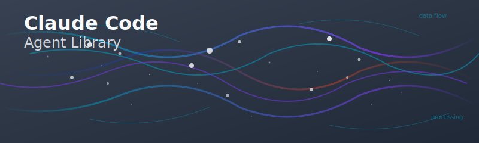

  

<h1 align="center">CC Agent Library</h1>

  <b>A modern, modular library for building and managing intelligent agents.</b>

---

## Overview

CC Agent Library is a flexible toolkit designed to accelerate the development and deployment of intelligent agents. It provides core abstractions, utilities, and integrations for agent-based systems, enabling you to build, customize, and scale agent workflows.
